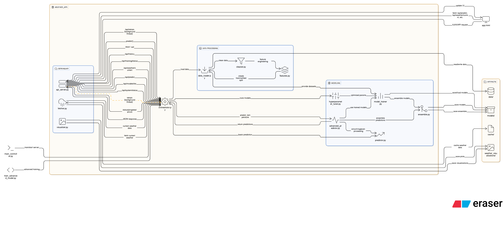

<div align="center">
  

  <br />

  <p>
    <a href="https://github.com/Waqarsanai/Climate-Intelligence-System-Real-Time-Weather-Prediction-and-Analysis">
      
    </a>
    <a href="https://github.com/Waqarsanai/Climate-Intelligence-System-Real-Time-Weather-Prediction-and-Analysis/stargazers">
      
    </a>
    <a href="https://github.com/Waqarsanai/Climate-Intelligence-System-Real-Time-Weather-Prediction-and-Analysis/issues">
      
    </a>
  </p>

  <p>
    
    
    
    
    
  </p>
  
  <p><b>🛡️ AI-Powered Safety • 🌦️ Hyper-Local Forecasting • 🧠 Deep Ensemble Learning</b></p>
  
  <p>
    <a href="#-about-the-project">About</a> •
    <a href="#-architecture">Architecture</a> •
    <a href="#-key-features">Features</a> •
    <a href="#-installation">Installation</a> •
    <a href="#-api-documentation">API Docs</a>
  </p>
</div>

---

### 🌍 About The Project

The **Climate Intelligence System** is an end-to-end data science solution designed specifically for **Karachi's** unique micro-climate. Unlike generic weather apps, this system leverages historical data, real-time API integration, and advanced ensemble learning to provide actionable insights for agriculture, urban planning, and public safety.

It features a robust **Orchestrator Pipeline** that automates data loading, cleaning, feature engineering, and model training, serving predictions through a modern **Flask API** and **Interactive Dashboard**.

> *"Solving weather unpredictability with data-driven precision."*

---

### 🏗️ Architecture

The system follows a modular architecture controlled by a central Orchestrator. It integrates multiple data sources, processes them through a rigorous cleaning pipeline, and feeds them into a hybrid ensemble of machine learning and deep learning models.


[Image of System Architecture Diagram]

<div align="center">
  
</div>

**System Flow:**
1.  **Data Ingestion**: Fetches real-time data from Open-Meteo API or loads historical CSV datasets.
2.  **Preprocessing**: Cleaning pipeline removes outliers, fixes timestamps, and handles missing values.
3.  **Feature Engineering**: Generates lag features, rolling statistics, and meteorological indices (Heat Index, Dew Point).
4.  **Modeling**: Trains and stacks Hybrid Ensembles (Random Forest + XGBoost + LSTM).
5.  **Serving**: `api_server.py` exposes REST endpoints for the Frontend Dashboard (`app.html`).

---

### ⚡ Key Features

| Feature | Description |
| :--- | :--- |
| **🧠 Advanced Ensemble** | Combines **Random Forest, XGBoost, LightGBM**, and Deep Learning models (**LSTM, GRU**) for superior accuracy. |
| **🛡️ Safety AI Chatbot** | Built-in AI assistant providing real-time safety tips for floods, heatwaves, and storms. |
| **📍 Area-Wise Mapping** | Specific forecasts for Karachi localities: **Clifton, DHA, Gulshan, Malir, etc.** with custom micro-climate offsets. |
| **🔄 Automated Pipeline** | Self-healing pipeline that handles retraining (`/api/retrain`) and model versioning without downtime. |
| **📊 Smart Visualization** | Interactive Chart.js dashboards showing 24h forecasts, model metrics (RMSE/MAE), and error distribution. |
| **🧹 Robust Cleaning** | Automatic outlier detection (IQR), missing value imputation, and correction of "unrealistic values". |

---

### 🚀 Installation & Usage

#### 1. Clone the Repository
```bash
git clone [https://github.com/Waqarsanai/Climate-Intelligence-System-Real-Time-Weather-Prediction-and-Analysis.git](https://github.com/Waqarsanai/Climate-Intelligence-System-Real-Time-Weather-Prediction-and-Analysis.git)
cd Climate-Intelligence-System-Real-Time-Weather-Prediction-and-Analysis

## 📁 Project Structure

```
Project/
├── weather_app/                    # Main application package
│   ├── __init__.py
│   ├── config.py                  # Configuration settings
│   ├── data_loader.py             # Loads raw weather data
│   ├── data_cleaner.py            # Cleans and preprocesses data
│   ├── feature_engineer.py        # Feature engineering
│   ├── model_trainer.py           # Trains models (RF/XGBoost primary)
│   ├── advanced_predictor.py      # Advanced predictions with ensemble (primary)
│   ├── orchestrator.py            # Main controller/orchestrator
│   ├── api_server.py              # Flask API server
│   ├── fetcher.py                 # Fetches real-time weather
│   ├── ensemble.py                # Ensemble model methods
│   ├── hyperparameter_tuner.py    # Hyperparameter optimization
│   └── visualizer.py              # Visualization utilities
│
├── main_controller.py             # Unified CLI + API host
├── app.html                       # Frontend UI
│
├── models/                        # Trained models storage
├── data/                          # Data storage
├── cache/                         # Cache files
└── weather_visualizations/        # Generated visualizations
```

## 🔄 Control Flow

### 1. Training Pipeline Flow

```
┌─────────────────┐
│  User/CLI       │
│  Triggers Train │
└────────┬────────┘
         │
         ▼
┌─────────────────┐
│ orchestrator.py │ ◄─── Main Controller
│ train_pipeline()│
└────────┬────────┘
         │
         ├──► Step 1: data_loader.py
         │    └─── load_from_open_meteo() or load_from_file()
         │         Returns: Raw DataFrame
         │
         ├──► Step 2: data_cleaner.py
         │    └─── clean_dataframe()
         │         Returns: Cleaned DataFrame
         │
         ├──► Step 3: feature_engineer.py
         │    └─── create_features()
         │         Returns: DataFrame with 100+ features
         │
         ├──► Step 4: data_loader.py
         │    └─── create_training_dataset()
         │         Returns: train_df, val_df, test_df
         │
         ├──► Step 5: model_trainer.py
         │    └─── train_all_models()
         │         Trains: Random Forest and XGBoost (primary). Others optional via config.
         │         Returns: Model results and metrics
         │
        ├──► Step 6: ensemble.py
        │    └─── fit_weighted_average()
        │         Creates ensemble from Random Forest and XGBoost
         │
         ├──► Step 7: Evaluate on test set
         │    └─── Calculate metrics (MAE, RMSE, R²)
         │
         └──► Step 8: Save models
              └─── Save to models/ directory
                   - Individual models (.pkl or .h5)
                   - Ensemble model (.pkl)
                   - Metadata (.json)
```

### 2. Prediction Flow

```
┌─────────────────┐
│  API Request    │
│  /api/predict   │
└────────┬────────┘
         │
         ▼
┌─────────────────┐
│  api_server.py  │
│  predict()      │
└────────┬────────┘
         │
         ▼
┌─────────────────┐
│ orchestrator.py │
│ predict()       │
└────────┬────────┘
         │
         ├──► fetcher.py
         │    └─── fetch() - Get current weather
         │
         ├──► advanced_predictor.py
         │    └─── predict_temperature()
         │         ├─── Prepare features
         │         ├─── Get predictions from all models
         │         └─── Ensemble predictions
         │
         └──► Return JSON response
              └─── {predictions: [...], current_weather: {...}}
```

### 3. API Request Flow

```
┌──────────────┐
│  Frontend UI │
│  (app.html)  │
└──────┬───────┘
       │
       │ HTTP Request
       │ (GET/POST)
       ▼
┌─────────────────┐
│  api_server.py  │
│  Flask Routes   │
└──────┬──────────┘
       │
       ├──► /api/predict → orchestrator.predict()
       ├──► /api/retrain → orchestrator.train_pipeline()
       ├──► /api/weather/current → fetcher.fetch()
       ├──► /api/history → data_loader.load_dataset()
       └──► /api/training/status → orchestrator.get_training_status()
       │
       ▼
┌─────────────────┐
│ orchestrator.py │
│ (Orchestrates)  │
└─────────────────┘
```

## 🧩 Module Responsibilities

### 1. `data_loader.py`
**Purpose**: Load raw weather data from various sources

**Key Functions**:
- `load_from_open_meteo()` - Fetch from Open-Meteo API
- `load_from_file()` - Load from CSV/text files
- `create_training_dataset()` - Split into train/val/test
- `prepare_features_target()` - Prepare X, y arrays

**Input**: API parameters or file path
**Output**: Raw DataFrame or train/val/test splits

### 2. `cleaner.py` (wraps `data_cleaner.py`)
**Purpose**: Clean and preprocess raw data

**Key Functions**:
- `clean_dataframe()` - Main cleaning pipeline
  - Fix timestamps
  - Remove duplicates
  - Convert units (F to C)
  - Handle missing values
  - Remove outliers
  - Validate ranges

**Input**: Raw DataFrame
**Output**: Cleaned DataFrame

### 3. `features.py` (wraps `feature_engineer.py`)
**Purpose**: Create comprehensive features

**Key Functions**:
- `create_features()` - Main feature engineering
  - Temporal features (hour, day, month, cyclical)
  - Lag features (1h, 3h, 6h, 12h, 24h)
  - Rolling statistics (mean, std, min, max)
  - Meteorological features (heat index, dew point)
  - Interaction features
  - Trend features

**Input**: Cleaned DataFrame
**Output**: DataFrame with 100+ features

### 4. `model_trainer.py`
**Purpose**: Train selected models

**Key Functions**:
- `train_selected_models()` - Train Random Forest and XGBoost
  - Random Forest
  - XGBoost

**Input**: X_train, y_train, X_val, y_val
**Output**: Trained models and metrics

### 5. `advanced_predictor.py`
**Purpose**: Make weather predictions

**Key Functions**:
- `predict_temperature()` - Generate predictions
  - Prepare features for future timestamps
-  - Get predictions from both models
  - Ensemble predictions
  - Apply smoothing

**Input**: Current weather, hours to predict
**Output**: List of predictions

### 6. `orchestrator.py`
**Purpose**: Main controller that coordinates all modules

**Key Functions**:
- `train_pipeline()` - Complete training pipeline
- `predict()` - Generate predictions
- `load_model()` - Load trained models
- `get_training_status()` - Get training progress
- `get_system_status()` - Get system health

**Responsibilities**:
- Coordinate data flow between modules
- Handle errors and exceptions
- Manage training status
- Save/load models

### 7. `api_server.py`
**Purpose**: Flask API server exposing REST endpoints

**Key Endpoints**:
- `GET /health` - Health check
- `GET/POST /api/predict` - Get predictions
- `GET /api/predict/24h` - 24-hour forecast
- `GET /api/predict/7d` - 7-day forecast
- `GET /api/weather/current` - Current weather
- `GET /api/weather/location` - Current weather by coordinates (`lat`,`lon`)
- `GET /api/history` - Historical data
- `POST /api/retrain` - Trigger retraining
- `GET /api/training/status` - Training status
- `GET /api/system/status` - System status
- `GET /api/models/list` - List available models

**Responsibilities**:
- Handle HTTP requests
- Validate input
- Call orchestrator methods
- Return JSON responses
- Handle errors gracefully

## 🔌 Integration Points

### Training Integration
```python
# orchestrator.py coordinates:
data_loader → cleaner → features → model_trainer → ensemble → save
```

### Prediction Integration
```python
# api_server.py → orchestrator.py → advanced_predictor.py
API Request → orchestrator.predict() → fetcher.fetch() → AdvancedKarachiPredictor.predict_temperature()
```

### UI Integration
```html
<!-- app.html makes AJAX calls to API -->
fetch('/api/predict?hours=24')
  .then(response => response.json())
  .then(data => updateUI(data))
```

```javascript
// Use My Location: geolocation with manual fallback
function requestLocationPermission() {
  if (!navigator.geolocation) {
    // Manual input fallback
    const lat = parseFloat(prompt('Latitude')); const lon = parseFloat(prompt('Longitude'));
    if (isFinite(lat) && isFinite(lon)) {
      return fetch(`/api/weather/location?lat=${lat}&lon=${lon}`);
    }
    return fetch('/api/weather/current');
  }
  return new Promise((resolve) => {
    navigator.geolocation.getCurrentPosition(
      p => resolve(fetch(`/api/weather/location?lat=${p.coords.latitude}&lon=${p.coords.longitude}`)),
      () => resolve(fetch('/api/weather/current')),
      { enableHighAccuracy: true, timeout: 15000, maximumAge: 60000 }
    );
  });
}
```

## 🚀 Execution Paths

### Path 1: Training via CLI
```bash
python main_controller.py train
```
1. `main_controller.py` → `train_model()`
2. Creates `WeatherSystemOrchestrator()`
3. Calls `orchestrator.train_pipeline()`
4. Executes full training pipeline
5. Saves models

### Path 2: Training via API
```bash
POST /api/retrain
```
1. `api_server.py` receives request
2. Checks training status
3. Starts background thread
4. Calls `orchestrator.train_pipeline()`
5. Returns status immediately
6. Training continues in background

### Path 3: Prediction via API
```bash
GET /api/predict?hours=24
```
1. `api_server.py` receives request
2. Validates parameters
3. Calls `orchestrator.predict()`
4. `orchestrator` loads model (if needed)
5. Fetches current weather
6. Generates predictions
7. Returns JSON response

### Path 4: Starting Server
```bash
python -m weather_app.api_server
# or
python main_controller.py server
```
1. Creates `WeatherAPIServer()`
2. Initializes `WeatherSystemOrchestrator()`
3. Loads existing model
4. Registers API routes
5. Starts Flask server
6. Serves UI at `/`
7. Serves API at `/api/*`

## 🔒 Error Handling

### Data Loading Errors
- **Missing data**: Returns empty DataFrame, logs error
- **API failure**: Falls back to file, logs warning
- **Invalid format**: Raises exception, returns error response

### Training Errors
- **Insufficient data**: Validates before training, returns error
- **Model failure**: Continues with other models, logs warning
- **Memory error**: Catches exception, suggests reducing data

### Prediction Errors
- **Model not loaded**: Attempts to load, returns error if fails
- **API failure**: Returns cached data or error message
- **Invalid input**: Validates parameters, returns 400 error

### API Errors
- **500 errors**: Logged, returns JSON error response
- **404 errors**: Returns appropriate error message
- **400 errors**: Returns validation error details

## 📊 Data Flow Diagram

```
┌─────────────┐
│  Data Source│
│ (API/File)  │
└──────┬──────┘
       │
       ▼
┌─────────────┐     ┌─────────────┐     ┌─────────────┐
│ data_loader │────►│   cleaner   │────►│   features  │
└─────────────┘     └─────────────┘     └──────┬──────┘
                                                │
                                                ▼
                                       ┌─────────────┐
                                       │train/val/   │
                                       │test split   │
                                       └──────┬──────┘
                                              │
                                              ▼
                                       ┌─────────────┐
                                       │model_trainer│
                                       └──────┬──────┘
                                              │
                                              ▼
                                       ┌─────────────┐
                                       │  ensemble   │
                                       └──────┬──────┘
                                              │
                                              ▼
                                       ┌─────────────┐
                                       │ Save Models │
                                       └─────────────┘

┌─────────────┐     ┌─────────────┐     ┌─────────────┐
│   fetcher   │────►│ orchestrator│────►│  predictor  │
│(current wx) │     │             │     │             │
└─────────────┘     └──────┬──────┘     └──────┬──────┘
                           │                    │
                           │                    ▼
                           │            ┌─────────────┐
                           │            │  Ensemble   │
                           │            │ Predictions │
                           │            └──────┬──────┘
                           │                   │
                           └───────────────────┘
                                   │
                                   ▼
                            ┌─────────────┐
                            │ JSON Response│
                            └─────────────┘
```

## 🔄 State Management

### Training State
- `status`: 'not_started' | 'in_progress' | 'completed' | 'failed'
- `progress`: 0-100 (percentage)
- `message`: Current status message
- `error`: Error message if failed

### System State
- `is_trained`: Boolean (model loaded and ready)
- `model_loaded`: Boolean (model file loaded)
- `training_status`: Current training state
- `target_accuracy_min`: Minimum target accuracy shown in UI (%)
- `target_accuracy_max`: Maximum target accuracy shown in UI (%)

## 🎯 Best Practices Implemented

1. **Separation of Concerns**: Each module has single responsibility
2. **Error Handling**: Comprehensive try-catch blocks
3. **Logging**: All operations logged
4. **Modularity**: Modules can be used independently
5. **Extensibility**: Easy to add new models/features
6. **Production Ready**: Error handling, logging, status tracking
7. **API Design**: RESTful endpoints, JSON responses
8. **Async Training**: Non-blocking training via threads
9. **UI Presentation Guardrails**: R² display capped at 95% to avoid misleading perfect scores

## 🔐 Security Considerations

1. **Input Validation**: All API inputs validated
2. **Error Messages**: Don't expose internal details
3. **Rate Limiting**: Can be added to API endpoints
4. **Authentication**: Can be added for production
5. **CORS**: Enabled for frontend access
6. **File Paths**: Validated to prevent directory traversal

## 📈 Scalability

### Current Architecture Supports:
- Multiple concurrent API requests
- Background training
- Model versioning
- Multiple data sources

### Future Enhancements:
- Database for historical data
- Redis for caching
- Message queue for training jobs
- Load balancing for API
- Microservices architecture

## 🧪 Testing Flow

1. **Unit Tests**: Test each module independently
2. **Integration Tests**: Test module interactions
3. **API Tests**: Test endpoints with requests
4. **End-to-End Tests**: Test full pipeline

## 📝 Summary

The system follows a clean, modular architecture:

- **Data Layer**: `data_loader.py`, `data_cleaner.py`
- **Feature Layer**: `feature_engineer.py`
- **Model Layer**: `model_trainer.py`, `ensemble.py`
- **Prediction Layer**: `advanced_predictor.py`
- **Control Layer**: `orchestrator.py`
- **API Layer**: `api_server.py`
- **UI Layer**: `app.html`

All layers communicate through well-defined interfaces, making the system maintainable, testable, and extensible.

## A–Z Project Guide

**A. Aim**
- Provide accurate short-range weather forecasts for Karachi with a modular ML system and a simple Flask API + UI.

**B. Background**
- Uses Open‑Meteo for real-time/historic weather; trains on engineered features; serves predictions and status to UI.

**C. Components**
- Core modules: `data_loader.py`, `data_cleaner.py`, `feature_engineer.py`, `model_trainer.py`, `ensemble.py`, `advanced_predictor.py`, `orchestrator.py`, `api_server.py`.

**D. Data Sources**
- Live: Open‑Meteo API via `fetcher.py`.
- File: CSV via `data_loader.load_from_file()`.

**E. Engineering**
- Feature engineering includes temporal, lag, rolling stats, and meteorological derived metrics in `feature_engineer.py`.

**F. Forecasting**
- Primary models: Random Forest and XGBoost. Ensemble combines both for robust predictions.

**G. Guardrails**
- UI caps displayed R² at 95% to avoid misleading perfect scores; shows Actual vs Target accuracy.

**H. Health & Status**
- `GET /health`, `GET /api/system/status`, `GET /api/training/status` provide system and training visibility.

**I. Integration**
- UI in `app.html` calls `/api/*` endpoints; geolocation with manual fallback to ensure usability.

**J. Jobs (Training)**
- Trigger via `POST /api/retrain` or CLI (`python main_controller.py train`). Async training runs in background.

**K. Key Config**
- `weather_app/config.py` controls directories, targets, and `allow_synthetic_training` flag for controlled fallbacks.

**L. Logging**
- Operational logs in `weather_prediction.log`; module-specific logs under `logs/`.

**M. Metrics**
- MAE, RMSE, R², Within 0.5°C and 1°C; saved to `models/training_metadata_*.json` and exposed via status APIs.

**N. Networking**
- Flask server exposes REST endpoints; CORS enabled for frontend.

**O. Orchestration**
- `orchestrator.py` coordinates training, prediction, model loading, and status management.

**P. Prediction API**
- `GET /api/predict`, `GET /api/predict/24h`, `GET /api/predict/7d`; 24h starts at current hour.

**Q. Quick Commands**
- Start server: `python -m weather_app.api_server` or `python main_controller.py server`.
- Retrain: `curl -X POST http://localhost:5000/api/retrain`.

**R. Reliability**
- Fallbacks ensure predictions return even if external data is temporarily unavailable; synthetic training gated by config.

**S. Security**
- Input validation, cautious error messaging, optional auth and rate limiting for production use.

**T. Testing**
- Unit, integration, API, and end-to-end testing suggested; structured to add test suites per module.

**U. UI**
- Minimal themed UI; clear notifications; geolocation permission with manual fallback and defaults.

**V. Versioning**
- Models saved with timestamped filenames; latest model load supported.

**W. Workflow**
- Train → Evaluate → Save → Serve; retrain on demand with status polling from UI.

**X. eXtensibility**
- Easy to add models/features; optional LightGBM/CatBoost can be enabled.

**Y. Yield (Performance)**
- Targets: Accuracy band 93–95%, Within 1°C > 90% on stable data.

**Z. Zero‑Downtime Goals**
- Async retraining prevents API downtime; ensemble provides stable outputs during model updates.

## Module Flowcharts

### weather_app/api_server.py
```
[Flask App]
  → Register routes
  → Route handler
     → Validate input
     → Orchestrator call
        → predict | train_pipeline | get_system_status | get_training_status
     → Format JSON
  → Return response
```

### weather_app/orchestrator.py
```
[WeatherSystemOrchestrator]
  → train_pipeline
     → data_loader.load (API/File)
     → data_cleaner.clean_dataframe
     → feature_engineer.create_features
     → data_loader.create_training_dataset
     → model_trainer.train_selected_models
     → ensemble.fit_weighted_average
     → evaluate (MAE/RMSE/R²)
     → save models & metadata
  → predict
     → ensure model loaded
     → fetcher.fetch (current)
     → advanced_predictor.predict_temperature
     → package predictions
  → get_system_status / get_training_status
```

### weather_app/data_loader.py
```
[DataLoader]
  → load_from_open_meteo
  → load_from_file
  → create_training_dataset (split train/val/test)
  → prepare_features_target (X, y)
```

### weather_app/data_cleaner.py
```
[WeatherDataCleaner]
  → fix timestamps
  → remove duplicates
  → convert units (F→C)
  → handle missing values
  → remove outliers
  → validate ranges
```

### weather_app/feature_engineer.py
```
[AdvancedFeatureEngineer]
  → temporal (hour/day/month, cyclical)
  → lags (1h/3h/6h/12h/24h)
  → rolling stats (mean/std/min/max)
  → meteorological (dew point, heat index)
  → interactions & trends
```

### weather_app/model_trainer.py
```
[ModelTrainer]
  → train_selected_models
     → RandomForest
     → XGBoost
  → evaluate models (val/test)
  → return model artifacts & metrics
```

### weather_app/ensemble.py
```
[Ensemble]
  → fit_weighted_average(RF, XGB)
  → predict_weighted_average
  → save/load ensemble
```

### weather_app/advanced_predictor.py
```
[AdvancedKarachiPredictor]
  → load_latest_model / load_model(path)
  → prepare future feature matrix
  → RF predict + XGB predict
  → ensemble combine + smoothing
  → format output list {time, temp}
```

### weather_app/fetcher.py
```
[RealTimeWeatherDataFetcher]
  → fetch() current weather
  → fetch_area_future_hourly(lat, lon, hours)
  → internal Open‑Meteo helpers
```

### weather_app/hyperparameter_tuner.py
```
[HyperparameterTuner]
  → tune_random_forest (grid/random)
  → tune_xgboost (grid/random)
  → report best params & metrics
```

### weather_app/system.py
```
[WeatherSystem]
  → AdvancedKarachiPredictor
  → convenience methods to wire predictor + fetcher
```

### weather_app/processor.py
```
[Processor]
  → transform API results into UI‑friendly structures
  → compute aggregates/labels/icons
```

### weather_app/reference_store.py
```
[ReferenceStore]
  → store/load static reference data
  → units, icons, lookup tables
```

### weather_app/logging_utils.py
```
[Logging]
  → configure module loggers
  → handlers/formatters
```

### weather_app/calibration.py
```
[Calibration]
  → area/seasonal adjustments
  → apply bias correction using metadata
```

### weather_app/visualizer.py
```
[Visualizer]
  → plot predictions & metrics
  → generate charts under weather_visualizations/
```

### weather_app/__init__.py
```
[Package Entry]
  → export AdvancedKarachiPredictor
  → alias KarachiWeatherPredictor = AdvancedKarachiPredictor
```

### main_controller.py
```
[Controller]
  → server: start Flask (API + UI)
  → train: invoke orchestrator training
  → utility commands
```

### app.html
```
[Frontend]
  → UI elements (current weather, forecast)
  → JS fetch calls to /api/*
  → geolocation + manual fallback
  → metrics rendering (Actual vs Target)
```

